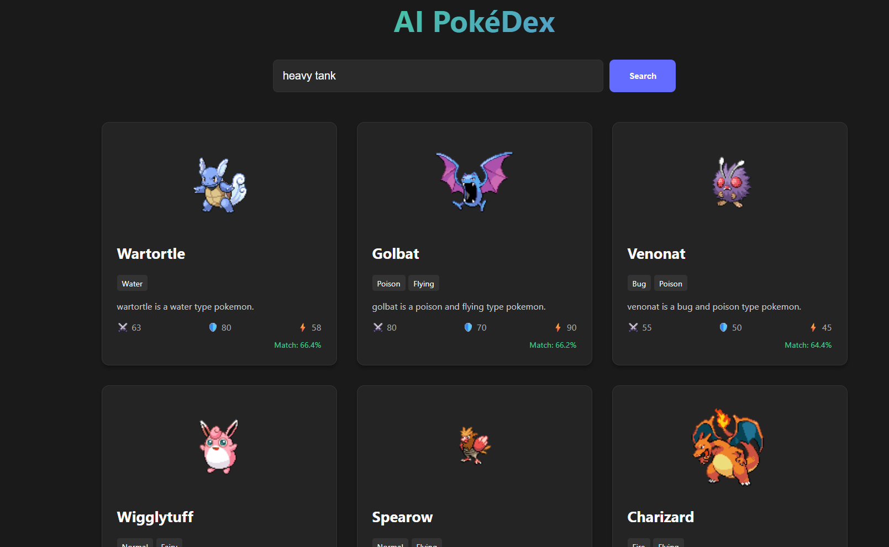

#  AI PokéDex - Semantic Search Engine

A Full-Stack AI-powered Pokémon search engine that uses **Vector Embeddings** and **MongoDB Atlas** to perform semantic searches. Unlike traditional keyword search, this application understands the *context* of a query .

 

##  Features

- **Semantic Search:** Uses Natural Language Processing (NLP) to understand queries like "fast fire pokemon" or "sleepy fat pokemon".
- **Vector Embeddings:** Generates 384-dimensional vectors for Pokémon descriptions using `@xenova/transformers` (all-MiniLM-L6-v2 model).
- **Architecture:** Decoupled architecture with a dedicated ETL (Extract, Transform, Load) pipeline for data seeding.
- **Performance:** Optimized vector search using MongoDB Atlas Vector Search indexing.
- **Modern UI:** Responsive, Dark-themed UI built with React and Vite.

##  Tech Stack

- **Frontend:** React.js, Vite, CSS3 (Modern Dark Theme)
- **Backend:** Node.js, Express.js
- **Database:** MongoDB Atlas (Vector Search)
- **AI/ML:** HuggingFace Transformers (`@xenova/transformers`) running locally.
- **Data Source:** PokéAPI

---

##  Architecture Design

The solution is designed with a clear separation of concerns, focusing on scalability and data integrity.

### 1. Data Ingestion Pipeline (ETL)
Instead of fetching data on the fly, a dedicated **Seeding Script** (`seed.js`) handles data preparation:
1.  **Extract:** Fetches raw data from the external **PokéAPI**.
2.  **Transform:** Cleans data and constructs a "Semantic Description" string (combining types, stats, and name).
3.  **Embed:** Converts the description into a Vector Embedding using the local Transformer model.
4.  **Load:** Stores the structured data + vector in **MongoDB**.

### 2. Search Request Flow
1.  **Client:** User sends a natural language query (e.g., "Water turtle").
2.  **Server:** The backend converts the query string into a Vector using the same Transformer model.
3.  **Database:** Performs a **Cosine Similarity Search** in MongoDB Atlas to find the nearest matching vectors.
4.  **Response:** Returns sorted results with a "Match Score".

---

##  Setup & Installation

### Prerequisites
- Node.js (v18+)
- MongoDB Atlas Account (Free Tier works)
